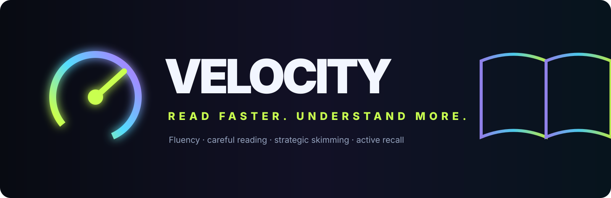

# Velocity — English Reading Fluency

**Train the bottleneck. Not just the timer.**

[Launch the live app](https://benclawbot.github.io/Velocity-reading/)

Velocity is a self-contained speed-reading and English-fluency trainer. It is designed around controlled comprehension rather than chasing a universal WPM number: speed counts when understanding remains strong, and results are compared within matched reading modes and difficulty.

## Features

### Three reading gears
- **Fluency** — comfortable material for automaticity and smooth forward reading, with ≥85% comprehension as the controlled-reading threshold.
- **Careful reading** — deliberately slower reading for dense or important material where detail and inference matter.
- **Skim for gist** — time-limited reading for structure and main ideas, scored separately so skimming never inflates normal-reading baselines.

### 24-lesson progression
Six worlds, four lessons each:
1. **Phrase Vision** — phrase grouping and chunk recognition.
2. **Forward Flow** — guided reading and smoother forward movement.
3. **Word Automaticity** — vocabulary, academic chunks and word families.
4. **Flexible Speed** — punctuation rhythm, sentence complexity and pacing.
5. **Real Reading** — transfer practice with meaningful texts.
6. **Independent Fluency** — reduced guidance, longer reading and a final mastery challenge.

### Skill training
Velocity tracks separate mastery for:
- Phrase recognition
- Forward flow
- Vocabulary automaticity
- Flexible pacing
- Strategic skimming
- Active recall

The adaptive lesson system identifies the weakest skill and targets it instead of simply increasing speed.

### Comprehension-first measurement
- WPM is measured alongside comprehension.
- Normal controlled readings require **≥85% comprehension**.
- Skimming uses its own lower gist threshold and separate profile.
- Results are compared only with the same reading mode and similar difficulty.
- Rolling matched baselines use recent qualifying sessions rather than a universal target.

### Active recall and comprehension checks
Reading sessions include post-reading recall/comprehension work so that speed cannot hide loss of meaning. Recall is tracked as its own skill.

### Spaced vocabulary retrieval
Vocabulary practice uses scheduled retrieval. Correct words return later; missed words return sooner. Due words are surfaced directly from the home screen.

### Adaptive coaching
The app continuously identifies the current weakest reading skill and explains why that skill should be trained next.

### Boss challenges
Boss sessions compare performance against the reader's own controlled, difficulty-matched baseline and require strong comprehension. Bosses reward XP and coins when cleared.

### Gamification
- XP and levels
- Coins
- 1–3 star lesson mastery
- Daily streaks
- Daily lesson/comprehension/reading quests
- World progression
- Boss challenges

### Real reading
Built-in texts provide longer transfer practice. The app records actual reading time and follows reading with understanding checks.

### Use your own text
Paste any English text of at least 100 words and read it inside Velocity. Custom texts contribute to real-reading time but are intentionally not auto-scored for comprehension.

### Difficulty-aware practice
Reading sessions support **Easy**, **Normal**, and **Dense** material. Fluency mode includes a familiarity check so unfamiliar vocabulary does not get mistaken for a speed problem.

### Progress dashboard
Velocity shows:
- Controlled fluency WPM
- Average comprehension
- Vocabulary due today
- Real reading minutes
- Course position
- Six individual skill mastery values
- Daily quest progress
- Rolling baselines

### Local-first persistence
Progress is stored in browser `localStorage`, including XP, coins, completed lessons, skill mastery, sessions, reading minutes, streaks, quests, mode/difficulty baselines and vocabulary scheduling. No backend or account is required.

## Run locally

The application is a single HTML file with no build step. Open `index.html` in a modern browser, or serve the repository with any static HTTP server.

## GitHub Pages

The live version is published at:

**https://benclawbot.github.io/Velocity-reading/**

A GitHub Actions workflow in `.github/workflows/pages.yml` deploys the repository to GitHub Pages whenever `main` changes.

## Technology

- HTML
- CSS
- Vanilla JavaScript
- Browser localStorage
- No runtime dependencies
- No server required

## Privacy

Velocity runs locally in the browser. Reading progress is persisted in local browser storage rather than sent to an application backend.

## Repository structure

```text
.
├── index.html
├── assets/
│   └── velocity-banner.svg
├── .github/workflows/pages.yml
├── .nojekyll
└── README.md
```

## Design principle

Velocity treats speed as an outcome of stronger reading processes: phrase recognition, automatic vocabulary, forward flow, flexible pacing, strategic skimming and active recall. The goal is not to make the timer smaller at any cost; it is to read efficiently while preserving meaning.
